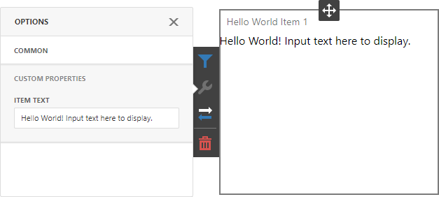
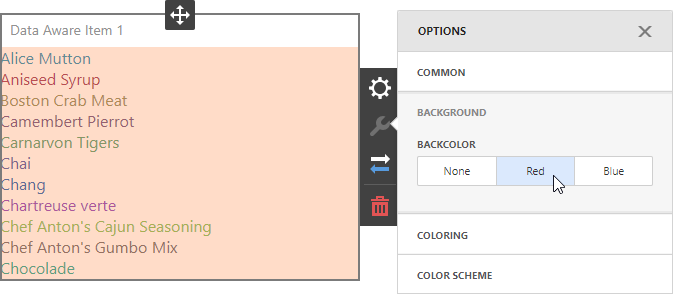
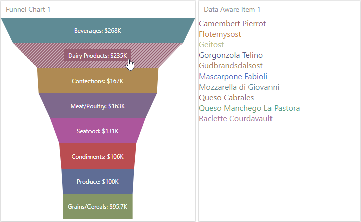

<!-- default file list -->

*Files to look at*:

* [HelloWorldItem.js](dashboard-react-app/src/HelloWorldItem.js)
* [DataAwareItem.js](dashboard-react-app/src/DataAwareItem.js)
* [FunnelChartItem.js](dashboard-react-app/src/FunnelChartItem.js)
* [App.js](dashboard-react-app/src/App.js)


<!-- default file list end -->

# Dashboard for React - Custom Item Tutorials

The example contains the source code of the scripts created in this step-by-step tutorials.


This example uses a client-server architecture. The server (backend) project communicates with the client (frontend) application that includes all the necessary styles, scripts and HTML templates. Note that the script version on the client must match the version of libraries on the server.

- The [asp-net-core-server](asp-net-core-server) folder contains the backend project built with ASP.NET Core 3.1.
- The [dashboard-react-app](dashboard-react-app) folder contains the client application built with React.

## Static Custom Item

**View Tutorial**: [Create a Static Custom Item](https://docs.devexpress.com/Dashboard/119836/web-dashboard/ui-elements-and-customization/create-a-custom-item/create-a-static-item)

**View Script**: [HelloWorldItem.js](dashboard-react-app/src/HelloWorldItem.js)

The script contains a HelloWorld [static custom item](https://docs.devexpress.com/Dashboard/119836/web-dashboard/ui-elements-and-customization/create-a-custom-item/create-a-static-item) with a [custom property](https://docs.devexpress.com/Dashboard/401702/web-dashboard/client-side-customization/custom-properties) that allows you to change the static text.




## Data-Aware Custom Item

**View Tutorial**: [Create a Data-Aware Custom Item](https://docs.devexpress.com/Dashboard/119837/web-dashboard/ui-elements-and-customization/create-a-custom-item/create-a-data-aware-item)

**View Script**: [DataAwareItem.js](dashboard-react-app/src/DataAwareItem.js)

This script contains a [data-aware custom item](https://docs.devexpress.com/Dashboard/119837/web-dashboard/ui-elements-and-customization/create-a-custom-item/create-a-data-aware-item) that displays [formatted](https://docs.devexpress.com/Dashboard/116539/common-features/data-shaping/formatting-data) [dimension values](https://docs.devexpress.com/Dashboard/116535/common-features/data-shaping/grouping) and allows users to [color](https://docs.devexpress.com/Dashboard/116915/common-features/appearance-customization/coloring) these values.



## Data-Aware Item based on External Visualization Widget

**View Tutorial**: [Create a Data-Aware Item based on an External Visualization Widget](https://docs.devexpress.com/Dashboard/119838/web-dashboard/ui-elements-and-customization/create-a-custom-item/create-a-data-aware-item-using-an-external-visualization-widget)

**View Script**: [FunnelChartItem.js](dashboard-react-app/src/FunnelChartItem.js)

This script contains a more "real-world" custom item that uses an external visualization widget. In this example, it is the [dxFunnel](https://js.devexpress.com/DevExtreme/ApiReference/UI_Components/dxFunnel/) widget that can show values across multiple stages in a process. This widget supports [data binding](https://docs.devexpress.com/Dashboard/116982/web-dashboard/create-dashboards-on-the-web/binding-dashboard-items-to-data/bind-dashboard-items-to-data-in-the-web-dashboards-ui), [master filtering](https://docs.devexpress.com/Dashboard/117060/web-dashboard/create-dashboards-on-the-web/interactivity/master-filtering), and [coloring](https://docs.devexpress.com/Dashboard/117152/web-dashboard/create-dashboards-on-the-web/appearance-customization/coloring).



## Quick Start

In the **asp-net-core-server** folder, run the following command:

```
dotnet run
```

See the following section for information on how to install NuGet packages from the DevExpress NuGet feed: [Install DevExpress Controls Using NuGet Packages](https://docs.devexpress.com/GeneralInformation/115912/installation/install-devexpress-controls-using-nuget-packages).

> This server allows CORS requests from _all_ origins with _any_ scheme (http or https). This default configuration is insecure: any website can make cross-origin requests to the app. We recommend that you specify the client application's URL to prohibit other clients from accessing sensitive information stored on the server. Learn more: [Cross-Origin Resource Sharing (CORS)](https://docs.devexpress.com/Dashboard/400709)

In the **dashboard-react-app** folder, run the following commands:

```
npm install
npm start
```

Open ```http://localhost:3000/``` in your browser to see the result.


## Documentation

- [Create a Custom Item](https://docs.devexpress.com/Dashboard/117546/web-dashboard/ui-elements-and-customization/create-a-custom-item)
- [Install DevExpress Controls Using NuGet Packages](https://docs.devexpress.com/GeneralInformation/115912/installation/install-devexpress-controls-using-nuget-packages)

## More Examples

- [Dashboard for ASP.NET Core - Custom Item Tutorials](https://github.com/DevExpress-Examples/asp-net-core-dashboard-custom-item-tutorials)